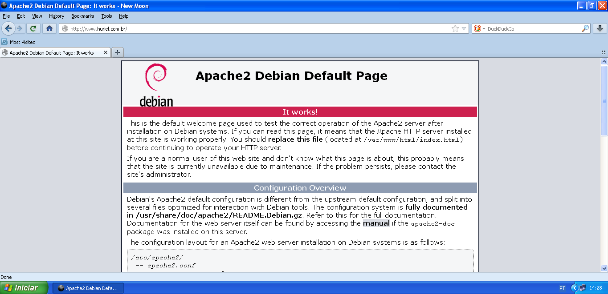
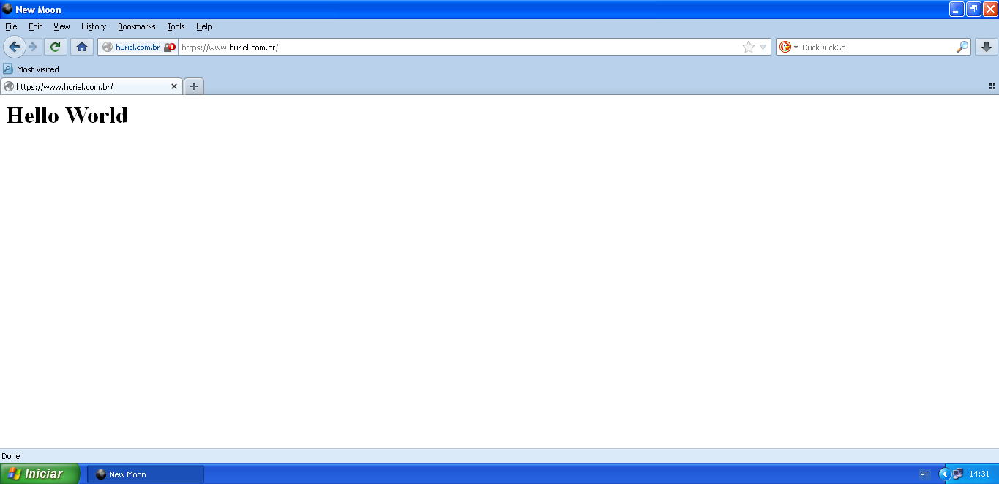
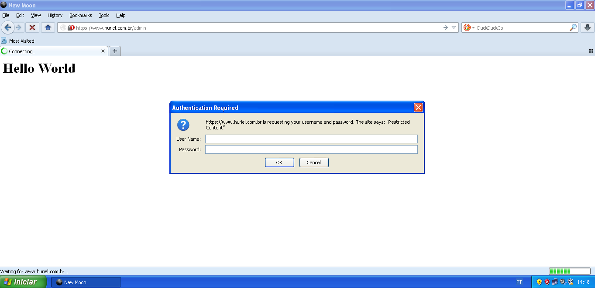
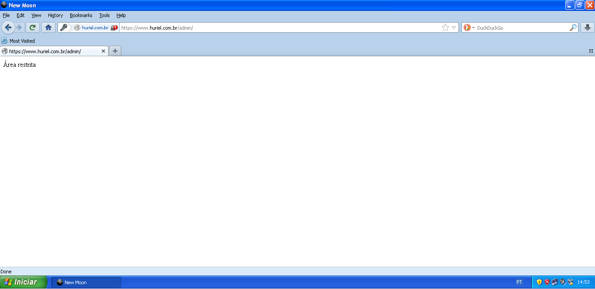

# Aula 25.05 - Configuração HTTPS
Hoje faremos o setup pra rodar a máquina com HTTPS, gerando os certificados e todas as necessidades para fazer funcionar.

## Habilitar HTTPS e criar certificado auto assinado 
* Para habilitar o SSL no Apache, use o comando: `a2enmod ssl`  
* Crie o diretório onde ficarão o certificado e a chave com o comando: `mkdir /var/www/huriel.com.br/ssl`  
* Entra no diretório criado: cd `/var/www/huriel.com.br/ssl/`  
* Para abrir o setup de criação da chave, use o comando: `openssl req -x509 -nodes -days 365 -newkey rsa:2048 -keyout huriel.com.br.key -out huriel.com.br.crt`
* Preencher as opções conforme a imagem:


* Configurar o apache para aceitar conexões https, alterando o arquivo ports.conf com o comando: nano /etc/apache2/ports.conf 
```
<IfModule mod_ssl.c> 
NameVirtualHost *:443 
 Listen 443 
</IfModule> 
```
**OBS**: O arquivo ports.conf não aceita mais de um módulo “escutando” a mesma porta, portanto, deixe somente o módulo acima configurado no arquivo.  
* Alterar o VHost ativando o SSL. Para isso edite o arquivo huriel.com.br.conf com o comando: `nano /etc/apache2/sites-available/huriel.com.br.conf` 
```
<VirtualHost *:443> 
 ServerAdmin webmaster@huriel.com.br 
 ServerName www.huriel.com.br 
 ServerAlias www.huriel.com.br 
 DocumentRoot /var/www/huriel.com.br 

 SSLEngine on 
 SSLCertificateFile /var/www/huriel.com.br/ssl/huriel.com.br.crt 
 SSLCertificateKeyFile /var/www/huriel.com.br/ssl/huriel.com.br.key 
</VirtualHost> 
```
**OBS**: Altere o <VirtualHost *:80> <VirtualHost *:443> e adicione as linhas para habilitar o ssh. O arquivo huriel.com.br.conf deve ficar como o modelo acima.  
* Utilize o comando `apache2ctl configtest` sempre que quiser verificar se a sintaxe das configurações do apache está correta.   
* Reinicie a máquina. (reboot)  
* Para testar acesse o site huriel.com.br através da máquina cliente. O endereço deverá ser direcionado para o https://www.huriel.com.br  
**OBS**: Por ser um certificado autoassinado, o navegador não será capaz de verificar a sua autoridade, gerando uma mensagem de erro. É possível acessar manualmente a URL https://www.huriel.com.br e permitir uma exceção pra essa URL, e dessa forma, a página do index.php deve estar visível.

### Teste do que foi implementado
Para testar, basta acessar a máquina cliente na URL: www.huriel.com.br. O resultado esperado deve ser o seguinte:



Em seguida, se acessar a URL https://www.huriel.com.br e criar uma exceção para acessar tal URL no seu navegador, o resultado esperado é a exibição da página do index.php:



## Criar uma área administrativa e configurar o acesso autenticado
* Criar o arquivo de senhas. Será criado um arquivo oculto .htpasswd no diretório de configuração do apache2 /etc/apache2. A opção -c é usada somente na primeira vez para criar o arquivo, se forem adicionados novos usuários, essa opção não deve ser colocada, pois sobrescreverá o arquivo. Para criar, use o comando: `htpasswd -c /etc/apache2/.htpasswd aluno`. Será pedido para digitar uma senha, a qual será solicitada quando tentar acessar a página em questão. Para visualizar se o arquivo foi criado e o usuário inserido digite `cat /etc/apache2/.htpasswd`  
* Ativar a autenticação por senha no apache com o comando: 
`nano /etc/apache2/sites-enabled/huriel.com.br.conf` para alterar o arquivo e adicionar o bloco o Directory:
```
<VirtualHost *:443> 
  ServerAdmin webmaster@huriel.com.br 
  ServerName www.huriel.com.br 
  ServerAlias www.huriel.com.br 
  DocumentRoot /var/www/huriel.com.br 

  SSLEngine on 
  SSLCertificateFile /var/www/huriel.com.br/ssl/huriel.com.br.crt 
  SSLCertificateKeyFile /var/www/huriel.com.br/ssl/huriel.com.br.key 

  <Directory "/var/www/huriel.com.br/admin"> 
    AuthType Basic 
    AuthName "Restricted Content" 
    AuthUserFile /etc/apache2/.htpasswd 
    Require valid-user 
  </Directory> 
</VirtualHost> 
```
* Criar o diretório admin, que foi configurado para ter a restrição de acesso com o comando `mkdir /var/www/huriel.com.br/admin`  
* Criar um arquivo php dentro da pasta admin `nano /var/www/huriel.com.br/admin/index.php` com o seguinte código:
```php
<?php 
 echo "<p>Área restrita</p>"; 
?> 
```
* Testar a sintaxe do que foi adicionado com o comando `apache2ctl configtest`  
* Reiniciar o apache com `systemctl restart apache2`

### Teste do que foi implementado
Ao acessar a URL https://www.huriel.com.br/admin o resultado esperado é um popup solicitando um usuário e senha para poder acessar aquela página. Esse usuário e senha são o que configuramos anteriormente para o aluno.



Ao preencher o login e senha, o resultado esperado será esse: 

